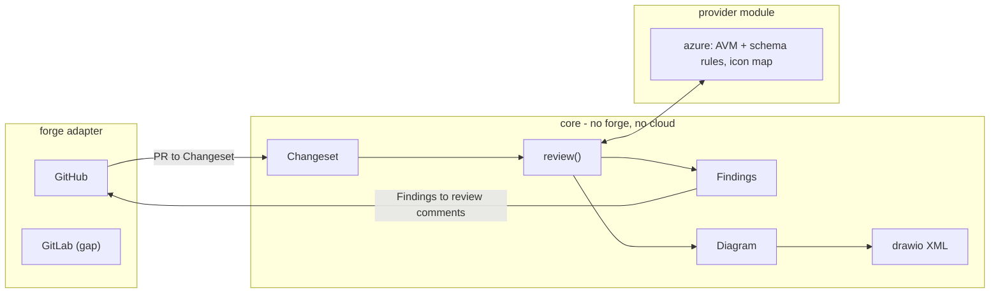
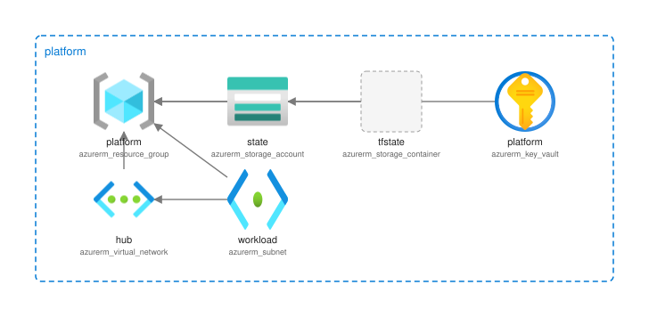

# iac-review

Reviews an Infrastructure-as-Code change and posts the result back to the pull
request: findings anchored to the lines that changed, plus a drawio diagram of
the infrastructure drawn with the real Azure icons.

Today it reviews Terraform targeting Azure, on GitHub. That is a deliberate
slice, not the plan — see [What it does not do yet](#what-it-does-not-do-yet).



The core never imports a forge type or a cloud type. Adding GitLab, or adding
AWS, is adding a module. [`tests/test_architecture.py`](tests/test_architecture.py)
enforces that by walking the imports, so the claim cannot quietly stop being true.

## Install

As an agent skill, which is how it is meant to be used:

```console
$ npx skills add LeTuR/iac-review --skill iac-review
```

That vendors [`skills/iac-review/SKILL.md`](skills/iac-review/SKILL.md) into your
agent. The skill body stands alone and reaches the CLI through `uvx`, so it
works without a clone.

As a CLI on its own:

```console
$ uvx --from git+https://github.com/LeTuR/iac-review iac-review
```

## Try it

```console
$ uv run iac-review review --path examples/fixture --diagram /tmp/platform.drawio.svg
review:
  source: examples/fixture
  origin: local
  files: 1
  findings: 4 (4 warning)
findings[4]{severity,location,rule,title}:
  warning,"main.tf:5",azure/avm-module-available,Use the AVM module for Resource Group
  warning,"main.tf:10",azure/avm-module-available,Use the AVM module for Storage Account
  warning,"main.tf:25",azure/avm-module-available,Use the AVM module for Key Vault
  warning,"main.tf:33",azure/avm-module-available,Use the AVM module for Virtual Network
diagram:
  path: /tmp/platform.drawio.svg
  nodes: 6
  edges: 6
  unmapped: 1
notes[2]{source,message}:
  azure/schema,"AzureRM provider schema is not cached, so schema rules were skipped"
  azure/icons,no Azure shape mapped for azurerm_storage_container
help[2]: ...
```

Against a pull request:

```console
$ iac-review review --target LeTuR/iac-review#7 --post --fail-on error
```

`--post` opens one GitHub review: findings that land on a changed line become
inline comments, the rest go in the review body.

## The CLI is an AXI

It follows [AXI](https://axi.md) `axi/1.0-2026-07`, so an agent can drive it
without reading a manual: TOON on stdout, minimal list schemas with the totals
pre-computed, definitive empty states, structured errors on stdout carrying the
command that fixes them, live state when invoked bare, and `--help` per command
with worked examples.

```console
$ iac-review review --pathh infra
error: unknown flag --pathh for `review`
help[2]: "valid flags for `review`: --cache, --diagram, --fail-on, ...",iac-review review --path infra --diagram infra.drawio
```

Exit codes: 0 success, 1 the run failed or `--fail-on` was met, 2 usage error.

The TOON encoder is [`core/toon.py`](src/iac_review/core/toon.py) — about sixty
lines covering the three forms this CLI emits, written against the specification
rather than taken as a 0.1.0 dependency. Session hooks (AXI §7) are not shipped:
a stateless reviewer has no per-directory live state worth loading into every
session, and the spec offers the installable skill as the complementary path.

## What it checks

**Azure Verified Modules.** A hand-rolled `azurerm_*` resource that AVM already
publishes a module for is a finding, with the registry source and the current
version in the suggested replacement. This is the highest-value check because it
tests a policy rather than syntax, and because AVM modules carry the WAF-aligned
defaults, diagnostics, private-endpoint and RBAC wiring that a bare resource
does not.

Child resources are not flagged. `azurerm_storage_container` resolves to
`Microsoft.Storage/storageAccounts/blobServices/containers`, which has no
top-level module of its own — the storage account module owns it.

**Provider schema.** `terraform providers schema -json` is authoritative for
what will actually apply, so an argument the AzureRM provider does not define is
an error. This needs `terraform` (or `tofu`) on `PATH`; without it the rule
reports itself skipped rather than failing the run:

```console
$ iac-review cache refresh --schema
```

## The diagram



That image is [`examples/output/platform.drawio.svg`](examples/output/platform.drawio.svg),
generated from [`examples/fixture`](examples/fixture) and committed, so the output
is reviewable rather than described. A test regenerates it and fails when it drifts.

`--diagram` picks the format from the extension:

| Extension | What you get |
| --- | --- |
| `.drawio.svg` | displays anywhere SVG renders **and** reopens in drawio for editing |
| `.drawio` | the plain editable file, which renders nowhere |

A `.drawio.svg` is one artifact doing both jobs. The drawio XML travels in the
root element's `content` attribute — the same mechanism drawio uses for its own
editable SVG export — so there is no image to keep in sync with a separate
source file. A test asserts the committed `.svg` carries the committed `.drawio`
byte for byte.

Nodes use drawio's own Azure 2 shape library, embedded as data URIs so the file
stands alone. Resources are grouped by the resource group they reference, a
resource group heads its own box, and a resource that names none — a storage
container, say — is pulled in beside the parent it hangs off. Edges follow the
interpolations between resources.

### Why SVG, and why not shell out to drawio

Both are deliberate, and both were checked rather than assumed.

**SVG, not PNG.** The captain asked for `.drawio.png` and/or `.drawio.svg`. SVG
alone is emitted: it scales, keeps text crisp, is a third the size, and renders
in every place a PNG would. A PNG would need rasterising, and drawio's own CLI
is [Electron 44](https://github.com/jgraph/drawio-desktop/blob/master/package.json) —
a browser and a virtual display in CI, for no display benefit.

**Emitted directly, not converted.** The renderer draws this tool's own model —
labelled image nodes, dashed group boxes, arrows — so nothing about drawio's
stencil engine is being reimplemented; the Azure shapes are SVG files placed as
images, exactly as drawio places them. That is why hand-emitting is safe here
and the Electron dependency is not the honest price.

### Getting it in front of a reviewer

A comment cannot reference a local file, so emitting the image is only half the
job. The two forges differ, and this is a platform fact rather than a
preference:

- **GitHub** publishes no endpoint for attaching an image to a review comment —
  its [OpenAPI description](https://github.com/github/rest-api-description)
  carries none; the only asset upload is for releases. What does work is a raw
  URL to a file committed at the head commit, which `raw.githubusercontent`
  serves as `image/svg+xml`. So a diagram committed alongside the Terraform is
  displayed inline in the review; one merely written to disk is named in the
  body instead of being silently dropped.
- **GitLab** does publish one: `POST /projects/:id/uploads` returns ready-made
  `markdown`, so a GitLab adapter can upload the generated file and show it even
  when nothing is committed. That is written up in
  [`forges/gitlab.py`](src/iac_review/forges/gitlab.py).

The icon mapping is data, not code:
[`src/iac_review/providers/azure/data/icons.json`](src/iac_review/providers/azure/data/icons.json).
Point `IAC_REVIEW_AZURE_ICONS` at your own file to override it. An unmapped
resource type is drawn as a labelled generic shape and reported as a diagnostic
— never dropped, never fatal. drawio's Azure library lags Microsoft's icon set,
so `iac-review icons audit` compares the map against the library drawio ships
today, and a weekly CI job runs it.

## Where the facts come from

Nothing is vendored. All three sources move independently, so they are fetched
and cached under `$XDG_CACHE_HOME/iac-review`, and `iac-review cache refresh`
re-pulls them. `iac-review cache status` shows what is cached, from where, and
when.

| Source | Used for | Why this one |
| --- | --- | --- |
| [AVM Terraform resource module index](https://azure.github.io/Azure-Verified-Modules/module-indexes/TerraformResourceModules.csv) | which ARM types have a published module | AVM publishes it as structured CSV and keeps it current, so there is nothing to scrape |
| [aztft resource map](https://github.com/magodo/aztft) | Terraform resource type to ARM resource type | the join key between the two worlds; this is the library behind Microsoft's [`Azure/aztfexport`](https://github.com/Azure/aztfexport) |
| [Terraform Registry](https://registry.terraform.io) | current version of a recommended module | where the version actually lives |
| `terraform providers schema -json` | every resource, argument and requiredness | machine-readable, local, and authoritative for the provider version you pin |
| [drawio Azure 2 shape library](https://github.com/jgraph/drawio/tree/dev/src/main/webapp/img/lib/azure2) | the icons | drawio resolves these paths itself, so the diagram needs no embedded assets |

The Terraform provider schema and Azure Verified Modules answer validity and
module conformance precisely, offline and per version, so they come first.
Official prose documentation remains the source for semantics no schema
carries — deprecations, constraints, regional availability, guidance about
what you should do rather than what is merely valid — and when it is needed
it would be fetched narrowly rather than by cloning the docs repository.

The one source that is not published by Microsoft is `aztft`. It is a
dependency of Microsoft's own `aztfexport`, it is cached and refreshable like
everything else, and a wrong entry can only mean a missed or misattributed AVM
suggestion — never a bad `terraform apply`.

## What it does not do yet

- **GitLab.** [`src/iac_review/forges/gitlab.py`](src/iac_review/forges/gitlab.py)
  is the shape of the gap: the class exists, is registered, raises
  `NotImplementedError`, and its docstring names the exact REST calls to fill
  in. GitLab's diffs are the same unified format, which is why the parser lives
  in the core. Nothing outside that file changes.
- **Clouds other than Azure.** `iac_review/providers/` takes a second module and
  one line in `_install()`.
- **IaC other than Terraform.** The parser is Terraform-specific and lives in
  the Azure provider.
- **A rule library.** Two rules ship. This is a skeleton with one working
  vertical slice, not a linter.
- **ARM resource-provider schemas**, the third validation source, for semantics
  the Terraform provider schema cannot express.

## Development

```console
$ uv sync
$ uv run pytest
$ prek install
```

`prek run --all-files` runs the same hooks CI does, including checkov. The
example fixture is excluded from checkov in [`.checkov.yaml`](.checkov.yaml):
it is deliberately non-conformant Terraform, and making it pass would delete the
findings it exists to produce.

There is no `terraform_fmt` hook. The only Terraform here is that one fixture,
and requiring a Terraform install to commit a Python change is a bad trade; the
fixture is hand-kept in canonical form.

The test suite runs entirely against `tests/data/cache`, a trimmed and frozen
copy of the upstream data, so it never touches the network and never changes
its mind when AVM ships a release.

Hooks run with [`prek`](https://github.com/j178/prek), not the Python
`pre-commit`. Dependency updates come from Renovate.
