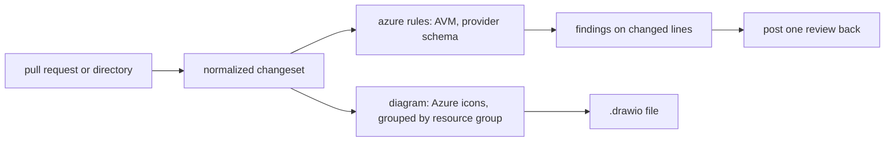

# iac-review

Reviews Terraform and reports two things a reviewer cannot get from the diff:
which hand-rolled resources Azure Verified Modules already publishes a module
for, and what the change actually deploys, as a diagram.



## Running it

Run the CLI as `iac-review`. When it is not on PATH,
`uvx --from git+https://github.com/LeTuR/iac-review iac-review` runs it from
source with the same commands; substitute that everywhere below. Inside a clone
of the repository, `uv run iac-review` works too.

It is an AXI (axi/1.0-2026-07): every command prints TOON on stdout - the
result, then a `help[]` array of next commands. Errors are structured on stdout
too (`error:` plus `help[]`), so read them rather than stderr. Exit code 1 means
the run failed or `--fail-on` was met; 2 means the invocation was wrong.

Run `iac-review` with no arguments to see what is cached and how much Terraform
is in the current directory. Run `iac-review <command> --help` for that
command's flags and worked examples.

First run, once per machine:

```console
$ iac-review cache refresh
```

That pulls the Azure Verified Modules index, the Terraform-to-ARM type map and
drawio's icon catalogue. They are cached under `$XDG_CACHE_HOME/iac-review` and
none of them is vendored, because all three move. Re-run it when findings look
stale. `iac-review cache status` shows what is cached and how large it is.

## Request

$ARGUMENTS

A pull request number or URL: review that pull request. A path: review the
Terraform under it. Empty: ask which.

## Reviewing a pull request

```console
$ iac-review review --target owner/repo#7 --diagram /tmp/change.drawio
```

Add `--post` to open one GitHub review: findings that land on a line the diff
touched become inline comments, the rest go in the review body. Do not pass
`--post` unless the user asked for the review to be posted.

Authentication comes from `GITHUB_TOKEN`, `GH_TOKEN`, or `gh auth token`.

GitLab is recognised as a target but not implemented yet; it exits with a
message naming what it needs.

## Reviewing a directory

```console
$ iac-review review --path infra --diagram infra.drawio
```

No forge, no posting. This is the right form for a working tree, a fixture, or
any checkout you already have on disk.

## Flags worth knowing

| Flag | Effect |
| --- | --- |
| `--full` | add a `details` array carrying each finding's detail, suggestion and references; the default list omits them |
| `--format json` | JSON instead of TOON, when a downstream tool needs it |
| `--diagram PATH` | write the diagram; `.drawio.svg` displays anywhere and stays editable, `.drawio` is the plain file. Omit it and no diagram is produced |
| `--fail-on error\|warning` | exit 1 when a finding at or above that severity exists |
| `--offline` | never fetch; use the cache as-is |

Exit codes: 0 clean, 1 `--fail-on` was met, 2 the run failed.

## Reading the output

```
review:
  source: infra
  origin: local
  files: 3
  findings: 2 (2 warning)
findings[2]{severity,location,rule,title}:
  warning,"main.tf:10",azure/avm-module-available,Use the AVM module for Storage Account
  warning,"main.tf:25",azure/avm-module-available,Use the AVM module for Key Vault
diagram:
  path: infra.drawio
  nodes: 6
  edges: 6
  unmapped: 1
notes[1]{source,message}:
  azure/schema,"AzureRM provider schema is not cached, so schema rules were skipped"
help[2]: ...
```

Two rules ship today.

- `azure/avm-module-available` (warning) — a hand-rolled `azurerm_*` resource
  that Azure Verified Modules publishes a module for. The suggestion carries the
  registry source and the current version, ready to paste. Child resources are
  not flagged: a storage container belongs to the storage account's module, not
  to one of its own.
- `azure/unknown-argument` (error) — an argument the AzureRM provider schema
  does not define, so `terraform plan` will reject it. This rule only runs when
  the provider schema is cached; generate it with
  `iac-review cache refresh --schema`, which needs `terraform` or `tofu` on
  `PATH` and downloads the provider.

The `notes` array holds diagnostics, not findings: a rule that was skipped, a
resource type with no Azure icon mapped, a cache that could not be refreshed.
Repeat them to the user. They say what the review could not see, and a silent
gap is worse than a reported one. `unmapped` in the `diagram` block counts
resources drawn without an Azure icon.

## The diagram

Prefer `--diagram <name>.drawio.svg`. That one file both displays — in a
browser, a file viewer, a pull request, a chat — and reopens in drawio for
editing, because the diagram source travels inside the image. A plain
`.drawio` renders nowhere, so only ask for it when something downstream needs
the bare XML.

Icons come from drawio's Azure shape library and are embedded in the file, so it
stands alone. Resources are grouped by resource group; edges follow the
interpolations between resources.

A resource type with no icon mapped is drawn as a labelled generic shape and
reported as a diagnostic — never dropped. Point `IAC_REVIEW_AZURE_ICONS` at your
own JSON file to override or extend the mapping. `iac-review icons audit`
compares the mapping against the Azure library drawio ships today.

### Showing it to a reviewer

On a pull request, a comment cannot reference a local file. If the diagram is
committed in the repository at the head commit, `--post` displays it inline in
the review. If it is only written to disk, the review body names the path
instead. So when the point is to show someone the diagram, write it to a path
inside the repository and commit it with the change.

## Limits

Terraform only, Azure only, GitHub only, two rules. Report these plainly when
asked to review something outside them rather than guessing:

- Other IaC languages (Bicep, ARM, OpenTofu-only syntax) are not parsed.
- Other clouds have no rules and no icons.
- GitLab merge requests cannot be fetched or posted to yet.

## Installing this skill

```sh
npx skills add LeTuR/iac-review --skill iac-review
```

Source and full documentation: <https://github.com/LeTuR/iac-review>
